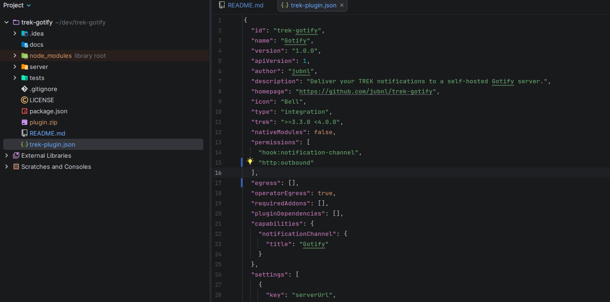

# Gotify for TREK

Deliver your TREK notifications to a self-hosted [Gotify](https://gotify.net) server.

## What it does

TREK can already notify you by email, webhook, and ntfy. This plugin adds **Gotify** as a
fourth channel, so trip invites, booking changes, reminders, and everything else land as a
push notification on your phone or desktop through your own Gotify server.

Once an admin enables the plugin and switches the channel on, "Gotify" appears as a new
column in **Settings → Notifications**, alongside Email and In-App. Every user picks their
own Gotify server and application token, and chooses per-event which notifications they want
pushed — exactly like the built-in channels. Nothing is shared between users: your token is
encrypted at rest and is only ever handed to the plugin at the moment a notification is being
delivered to you.

TREK renders each notification into your own language before passing it to the plugin, so
your pushes arrive translated, with the trip's deep link appended so tapping the notification
takes you straight to the relevant trip.

## Screenshots



## Permissions

| Permission | Why it's needed |
| --- | --- |
| `hook:notification-channel` | Registers Gotify as a notification channel so TREK can hand it your notifications to deliver. This is the whole point of the plugin. |
| `http:outbound` | Lets the plugin POST to a Gotify server. It can reach **only** the hosts in the manifest's `egress` list, plus any your admin adds under *Allowed hosts* (see Setup) — nothing else. |

This plugin deliberately requests **nothing else**. It cannot read your trips, your costs, or
your files. It is never given an acting user, so even the trip-reading APIs that other plugins
use are refused for it by the host — it only ever receives a message that is already written
and the credentials you yourself entered.

## Setup

1. **In Gotify** — go to *Apps → Create Application*, give it a name (e.g. "TREK"), and copy
   the application token.
2. **In TREK, as an admin** — install and enable the plugin, then add your Gotify host under
   *Admin → Plugins → ⋯ → Allowed hosts* (see below). Enabling the plugin is all the channel
   needs — there is no separate switch to flip.
3. **As any user** — open *Settings → Plugins → Gotify* and fill in:
   - **Gotify server URL** — e.g. `https://gotify.example.com`
   - **Application token** — the token you copied in step 1
   - **Priority** *(optional)* — Gotify priority, default `5`
4. Go to *Settings → Notifications*, tick the events you want pushed, and press **Send test**.

### Pointing it at your own Gotify

A published plugin cannot know your hostname, so this one declares `operatorEgress` — meaning
**an admin adds the host after installing**, rather than you having to fork the plugin.

In TREK: **Admin → Plugins → ⋯ → Allowed hosts**, then add e.g. `gotify.mydomain.com`. TREK
restarts the plugin so it picks up the new list. Until you do this, the plugin can only reach
`gotify.net` and every send will be refused.

Only an admin can add a host, and only for a plugin that declared `operatorEgress` — so this is
not a way for the plugin to reach anywhere it likes.

### Self-hosting on the same machine or LAN

If your Gotify runs at `localhost`, `192.168.x.x`, or a Docker service name, TREK's plugin
sandbox blocks it *even after you allow the host* — plugins may not reach private addresses by
default, which is the SSRF backstop that stops a plugin pivoting to your internal network.

To allow it, start TREK with:

```
TREK_PLUGIN_ALLOW_PRIVATE_EGRESS=on
```

Note this relaxes the policy for **all** installed plugins, not just this one, so only enable it
if you trust them all. The `egress` allow-list (manifest + the hosts your admin added) still
applies either way.

## License

MIT
